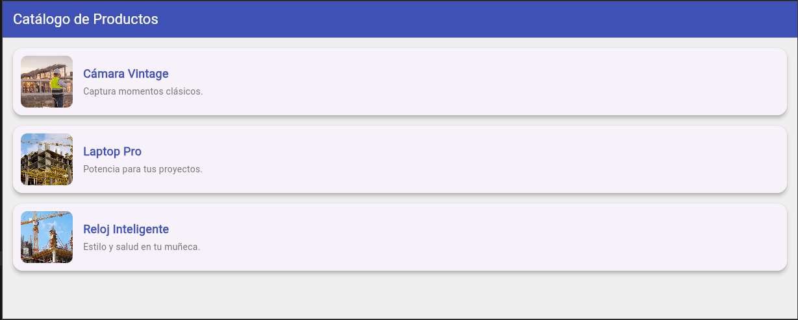

# myapp

# Mi prompt

Lenguaje dart, nivel principiante, en una columna insertar 3 filas, y en cada fila una tarjeta (card),en cada tarjeta (una imágen desde la red colocada a la izquierda, a la derecha una columna con 2 filas y en la primera fila un título, en la segunda fila un subtitulo, los textos alineados a la izquierda), la tarjeta con sombreado, utilizar colores atractivos, crear la clase producto, con los atributos (título, subtitulo y img_url)crear una lista de diccionarios por cada tarjeta. Proporciona el código correspondiente en un solo archivo.

## Mi diseño

